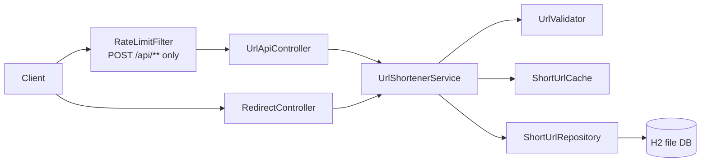

# URL Shortener

A production-oriented URL shortener built with Java 21, Spring Boot 4.1.1, Spring MVC, JPA, H2, Bean Validation, Actuator, an in-memory LRU redirect cache, and per-client token-bucket rate limiting.

## Features

| Capability | Implementation |
|---|---|
| Short URL creation | Random Base62 codes or caller-supplied aliases |
| Redirects | HTTP 302 with `Cache-Control: no-store` |
| TTL | Optional expiration in seconds |
| Analytics | Denormalized click counter plus last-access time |
| Persistence | File-backed H2 through JPA/Hibernate |
| Hot-path cache | Thread-safe bounded LRU, redirect path only |
| Abuse protection | Per-JVM token bucket on POST `/api/**` only |
| Validation | `http`/`https` only, valid host required |
| Operations | Actuator health, info, metrics; H2 console |

## Architecture



| Layer | Responsibility |
|---|---|
| controller | HTTP contract, status codes, redirect behavior |
| service | URL creation, resolution, TTL/active checks, click updates |
| repository | JPA persistence and atomic click increment |
| cache | Bounded access-ordered LRU for redirect lookups |
| ratelimit | POST-only token bucket keyed by client IP |
| dto | Request/response/error wire models |
| exception | Domain-specific failure types and centralized mapping |

## Key design decisions

Random Base62 identifiers are used instead of sequential IDs to make trivial enumeration harder. Clicks are stored as a denormalized counter so analytics reads remain O(1). Redirects use a small in-process LRU cache because this environment may block new Maven downloads; Caffeine with W-TinyLFU would be a stronger future in-process replacement. Metadata and analytics reads remain database-direct so they reflect the latest click count. Click increments are synchronous and atomic for analytics accuracy.

H2 file storage gives zero-setup durability while keeping persistence behind JPA so a production database such as PostgreSQL can replace it. Both the cache and rate limiter are per-JVM; a horizontally scaled deployment should move these concerns to Redis or another shared store. Authentication and administrative access control are intentionally out of scope and are a documented limitation.

## Run

Requirements: Java 21+ and a locally installed Maven. The Maven wrapper is intentionally not required because wrapper downloads can fail behind restrictive proxies.

```bash
mvn clean verify
mvn spring-boot:run
```

The service starts at `http://localhost:8080`. H2 console: `/h2-console`. Actuator health: `/actuator/health`.

## API examples

Create a generated code:

```bash
curl -i -X POST http://localhost:8080/api/v1/urls/create \
  -H 'Content-Type: application/json' \
  -d '{"url":"https://example.com/docs","ttlSeconds":3600}'
```

Create a custom alias:

```bash
curl -i -X POST http://localhost:8080/api/v1/urls/create \
  -H 'Content-Type: application/json' \
  -d '{"url":"https://example.com","customAlias":"example_1"}'
```

Read metadata and analytics:

```bash
curl http://localhost:8080/api/v1/urls/example_1
curl http://localhost:8080/api/v1/urls/example_1/analytics
```

Redirect:

```bash
curl -i http://localhost:8080/example_1
```

## Testing

The test profile uses an isolated in-memory H2 database with schema recreation. Unit tests cover URL validation, code generation, cache semantics, and service behavior with Mockito. Integration tests use `@SpringBootTest` and `MockMvcBuilders.webAppContextSetup` to exercise create, redirect, analytics, validation, not-found, and duplicate-alias behavior without relying on `TestRestTemplate`.

## Limitations / trade-offs

- No authentication, ownership, quotas, deletion API, or alias administration.
- Cache and rate-limit state are local to one JVM and reset on restart.
- Rate-limit buckets are not currently scavenged, so very high cardinality client IP traffic can grow the bucket map.
- Synchronous click counting prioritizes exact analytics over maximum redirect throughput.
- File-backed H2 is suitable for demonstration and small deployments, not high-concurrency multi-node production.
