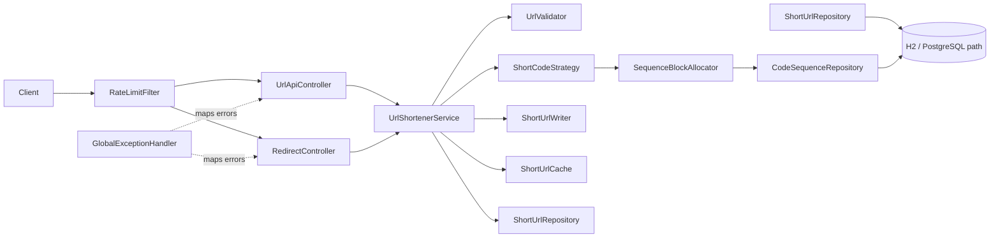

# Production-Grade URL Shortener

A production-oriented URL shortener implemented as a single Maven module with Java 21 and Spring Boot 4.1.1. It is also
a demonstration of engineer-led, AI-assisted execution: requirements are translated into explicit contracts,
implementation choices are reviewed against security/concurrency constraints, and automated tests provide the primary
validation gate.

- [Engineering Summary](ENGINEERING_SUMMARY.md)
- [Worked Scenarios](SCENARIOS.md)
- [Postman collection](UrlShortener.postman_collection.json)

## 1. Features

| Capability | Endpoint                                 | Behavior                                                                   |
|------------|------------------------------------------|----------------------------------------------------------------------------|
| Create     | `POST /api/v1/urls/create`               | Generates a code or accepts a validated custom alias; returns `201`.       |
| Redirect   | `GET /{shortCode}`                       | Resolves, records a click, disables downstream caching, and returns `302`. |
| Lookup     | `GET /api/v1/urls/{shortCode}`           | Returns URL metadata and current active/expiry state.                      |
| Analytics  | `GET /api/v1/urls/{shortCode}/analytics` | Returns click count, last access time, creation and expiry state.          |
| Health     | `GET /actuator/health`                   | Spring Boot health endpoint.                                               |
| Info       | `GET /actuator/info`                     | Spring Boot info endpoint.                                                 |

### Reliability & security guardrails

- URL validation accepts only HTTP (S), requires a host, rejects `localhost`/`*.localhost`, and rejects loopback,
  any-local, link-local, and site-local **IP literals** without DNS-resolving ordinary hostnames.
- Short-code generation is pluggable: SecureRandom Base62 by default, or a durable-counter Feistel strategy.
- Generated-code writes use `REQUIRES_NEW`, so a unique-key collision rolls back only the attempted insert.
- Redirect resolution is cache-first through a bounded thread-safe LRU cache.
- API creates are protected by a per-client token bucket with `Retry-After: 1` on rejection.
- TTLs are bounded and URLs also carry an explicit `active` flag.
- Hikari connection and validation timeouts plus transaction/query timeouts are configured to fail fast.
- All application errors use a consistent `ApiError` envelope; the rate-limit filter hand-builds its JSON and does not
  require Jackson.
- H2 console and detailed actuator exposure are disabled by default and enabled only by the `dev` profile.
- File-based H2 is the default local persistence layer; tests use isolated in-memory H2.

## 2. Architecture



| Layer               | Package      | Responsibility                                                                            |
|---------------------|--------------|-------------------------------------------------------------------------------------------|
| HTTP                | `controller` | API/redirect mappings and global error translation.                                       |
| Rate limiting       | `ratelimit`  | Per-client token buckets and servlet filter enforcement.                                  |
| Application service | `service`    | Validation orchestration, expiry, code generation, writes, redirects and click recording. |
| Cache               | `cache`      | Bounded redirect LRU and cache statistics.                                                |
| Persistence model   | `domain`     | `ShortUrl` and durable `CodeSequence` entities.                                           |
| Persistence access  | `repository` | JPA queries, atomic click update and pessimistic sequence locking.                        |
| API contracts       | `dto`        | Java-record request/response/error models.                                                |
| Configuration       | `config`     | Typed `app.*` properties.                                                                 |
| Errors              | `exception`  | Domain/application exceptions mapped by the controller advice.                            |

### Key design decisions

1. **Pluggable strategy:** code generation is an interface so random codes and Feistel codes can be selected by
   configuration without changing the service contract.
2. **Durable hi/lo allocation:** the Feistel strategy reserves counter blocks from a pessimistically locked database
   row, reducing lock frequency while preserving cross-process uniqueness. A process crash can leave unused values in a
   reserved block; those values are intentionally not reused.
3. **Cache-first redirects:** successful cache hits avoid a metadata read while the click count is still incremented
   atomically in the database.
4. **Write isolation:** each candidate insert is isolated with `REQUIRES_NEW`, preventing a duplicate-key rollback from
   poisoning the surrounding create operation.
5. **H2 → PostgreSQL:** the persistence model deliberately uses standard JPA plus a small number of portable
   locking/update semantics so the datasource/dialect can be migrated to PostgreSQL with managed migrations and
   production indexes.
6. **In-memory cache/limiter → Redis:** single-instance LRU and rate limiting are bounded and simple for this prototype;
   a multi-node deployment should move shared state to Redis or equivalent infrastructure.

## 3. Setup & Run

### Prerequisites

- Java 21
- Maven 3.9+ (or a Maven wrapper if one is added to the checkout)

### Test

```bash
mvn clean test
```

The current project contains **53 JUnit 5 tests**, including the requested core suite plus dedicated controller tests.
The controller regression around invalid short-code matching was corrected so the standalone controller test no longer
assumes full application mapping behavior.

### Run

```bash
mvn spring-boot:run
```

The service listens on `http://localhost:8080` by default.

### Development profile

```bash
mvn spring-boot:run -Dspring-boot.run.profiles=dev
```

The `dev` profile enables the H2 console and exposes `health,info,metrics,env,beans,loggers`, with health details always
shown. Do not enable that profile on an exposed production deployment.

### Configuration

| Property                            | Default                 | Purpose                                                                        |
|-------------------------------------|-------------------------|--------------------------------------------------------------------------------|
| `app.base-url`                      | `http://localhost:8080` | Base URL used to build returned short URLs.                                    |
| `app.max-ttl-seconds`               | `157680000`             | Maximum accepted TTL in seconds.                                               |
| `app.shortcode.length`              | `7`                     | Length of random Base62 codes.                                                 |
| `app.shortcode.strategy`            | `random`                | `random` or `feistel`.                                                         |
| `app.shortcode.feistel-bits`        | `40`                    | Feistel domain size in bits; must be positive, even, and <= 62.                |
| `app.shortcode.feistel-rounds`      | `4`                     | Number of Feistel rounds.                                                      |
| `app.shortcode.feistel-key`         | `2685821657736338717`   | Key material for the Feistel round function.                                   |
| `app.shortcode.sequence-block`      | `1000`                  | Number of durable counter values reserved per allocation block.                |
| `app.ratelimit.capacity`            | `100`                   | Maximum tokens held by each client bucket.                                     |
| `app.ratelimit.refill-per-minute`   | `100`                   | Linear token refill rate per minute.                                           |
| `app.ratelimit.trust-forwarded-for` | `false`                 | If true, use the first `X-Forwarded-For` hop; otherwise use `getRemoteAddr()`. |
| `app.ratelimit.max-clients`         | `100000`                | Maximum tracked client buckets before idle eviction.                           |
| `app.ratelimit.client-idle-minutes` | `30`                    | Idle age used when bounding client state.                                      |
| `app.cache.enabled`                 | `true`                  | Enables/disables redirect cache operations.                                    |
| `app.cache.max-size`                | `1000`                  | Maximum redirect cache entries.                                                |

Other operational defaults include file H2 at `jdbc:h2:file:./data/urlshortener`, `ddl-auto=update`,
`open-in-view=false`, UTC Hibernate timestamps, Hikari max pool 10/min idle 2, 3-second connection timeout, 2-second
validation timeout, 30-minute max lifetime, 3-second JPA query timeout, 5-second transaction timeout, H2 console
disabled, and actuator `health,info` exposure.

## 4. API Examples

### Create — generated code

```bash
curl -i -X POST http://localhost:8080/api/v1/urls/create \
  -H 'Content-Type: application/json' \
  -d '{"url":"https://example.com/docs"}'
```

Example response:

```json
{
  "shortCode": "aZ8kP2q",
  "shortUrl": "http://localhost:8080/aZ8kP2q",
  "originalUrl": "https://example.com/docs",
  "createdAt": "2026-10-03T12:00:00Z",
  "expiresAt": null,
  "clickCount": 0,
  "active": true
}
```

### Create — custom alias + TTL

```bash
curl -i -X POST http://localhost:8080/api/v1/urls/create \
  -H 'Content-Type: application/json' \
  -d '{"url":"https://example.com/docs","customAlias":"docs_1","ttlSeconds":3600}'
```

### Lookup metadata

```bash
curl http://localhost:8080/api/v1/urls/docs_1
```

### Redirect

```bash
curl -i http://localhost:8080/docs_1
```

Expected behavior is `302 Found`, `Location: https://example.com/docs`, and `Cache-Control: no-store`.

### Analytics

```bash
curl http://localhost:8080/api/v1/urls/docs_1/analytics
```

Example:

```json
{
  "shortCode": "docs_1",
  "originalUrl": "https://example.com/docs",
  "clickCount": 1,
  "createdAt": "2026-10-03T12:00:00Z",
  "lastAccessedAt": "2026-10-03T12:05:00Z",
  "expiresAt": "2026-10-03T13:00:00Z",
  "active": true
}
```

### Error envelope

```json
{
  "timestamp": "2026-10-03T12:00:00Z",
  "status": 400,
  "error": "Bad Request",
  "message": "Validation failed",
  "path": "/api/v1/urls/create",
  "fieldErrors": {
    "url": "must not be blank"
  }
}
```

The rate-limit filter returns a dependency-free hand-built envelope with `429` and `Retry-After: 1`.

### Postman

Import [UrlShortener.postman_collection.json](UrlShortener.postman_collection.json) into Postman. It defines
`{{baseUrl}}` and `{{shortCode}}`, and includes generated/custom creation, metadata, analytics, redirect,
invalid-scheme, unknown-code, and health requests.

## 5. Testing Approach

| Scope            | Test class                     | Focus                                                                              |
|------------------|--------------------------------|------------------------------------------------------------------------------------|
| Unit             | `UrlValidatorTest`             | Schemes, hosts, localhost and IP-literal SSRF guardrails.                          |
| Unit             | `ShortCodeGeneratorTest`       | Secure random Base62 length/alphabet.                                              |
| Unit             | `FeistelCodecTest`             | Permutation/bijection behavior.                                                    |
| Unit             | `FeistelCounterStrategyTest`   | Counter-to-code strategy behavior.                                                 |
| Integration/unit | `SequenceBlockAllocatorTest`   | Durable block reservation and non-reuse.                                           |
| Unit             | `UrlShortenerServiceTest`      | Create, collision retry, TTL, resolution, click counting, expiry and active state. |
| Unit             | `ShortUrlCacheTest`            | LRU eviction and cache enablement.                                                 |
| Unit             | `RateLimitFilterTest`          | POST-only scope and client-key behavior.                                           |
| Controller       | `UrlShortenerControllerTest`   | HTTP status/body mapping and validation using MockMvc.                             |
| Controller       | `RedirectControllerTest`       | Redirect response, headers and exception mapping.                                  |
| Integration      | `UrlShortenerIntegrationTest`  | Real Spring MVC/JPA create, redirect, analytics, validation and alias conflict.    |
| Context          | `UrlshortenerApplicationTests` | Application context boot.                                                          |

All tests use an isolated in-memory H2 database from `src/test/resources/application.properties` with
`ddl-auto=create-drop`; they do not write to the runtime `data/` directory. The suite is intentionally deterministic and
uses MockMvc rather than `TestRestTemplate`.

## 6. Limitations & Trade-offs

### Resolved in this prototype

- **Synchronous click counting:** every successful redirect performs one atomic database increment. This makes analytics
  immediately consistent with the redirect path at the cost of write latency.
- **Single-instance cache/limiter:** both are bounded, thread-safe in-memory components and are therefore predictable on
  one application instance.
- **No auth/IDOR:** the prototype deliberately has no identity/ownership model; possession of a code is enough to
  request its metadata/analytics.
- **Schema management:** `ddl-auto=update` keeps local setup friction low; production should use Flyway/Liquibase, add
  an expiry-oriented index, and use a purge/retention job if expired records are to be removed.
- **SSRF depth:** the validator blocks local/private IP literals and localhost names but deliberately does not
  DNS-resolve ordinary hostnames, avoiding a DNS TOCTOU pattern. A production egress control layer should complement
  this.
- **H2 → PostgreSQL:** the application is structured for a datasource/dialect migration, but a production PostgreSQL
  rollout still needs managed migrations, load testing, and operational tuning.

### Still deferred

- Distributed/shared rate limiting and redirect caching.
- Authentication, authorization, ownership, and abuse-management workflows.
- Async click ingestion/aggregation for high redirect throughput.
- Full DNS-aware SSRF defenses, redirect-chain inspection, egress proxying, and allow/deny policy management.
- Production schema migration tooling and expired-row lifecycle management.

## 7. Further Documentation

- [ENGINEERING_SUMMARY.md](ENGINEERING_SUMMARY.md) — requirement interpretation, execution traceability, risks,
  assumptions and oversight.
- [SCENARIOS.md](SCENARIOS.md) — three worked engineering scenarios covering expiry, abuse protection and ambiguous
  analytics requirements.
- [UrlShortener.postman_collection.json](UrlShortener.postman_collection.json) — runnable API examples.

## 8. Runtime Data & Repository Hygiene

The default file-based H2 datasource creates its database under `data/` at runtime. The repository ignores both `data/`
and Maven `target/` output. Test configuration points to an in-memory database, so tests do not touch the runtime H2
files.
